# P0_wireframe DAM

En esta ocasión he creado el diseño de una tienda de guitarras de lujo llamada "**Golden Strings**" para un cliente, qué tendrá: 
- Autentificación de registro y login de usuario
- Página principal
- Catálogo de productos
- Detalles del producto
- Carrito de compra y Checkout
- Noticias y Blogs

## Autentificación de registro y login de usuario

Para la autentificación, he empezado por el **Login**, el usuario al entrar, se encontrará con el nombre de la aplicación en grande y con una bienvenida, podrá acceder con el "nombre" o el "email" y por último su contraseña. Tendrá la opción de entrar sin registrarse (Continuar), pero eso lo limitará a la hora de realizar una compra. También tiene la opción de registrarse si no tiene una cuenta o la opción de reestablecer su contraseña en caso de olvido. 

    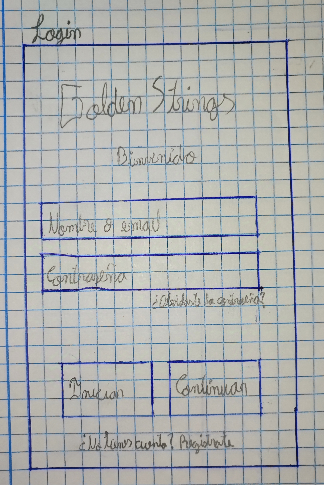

En el **Registro** se mostrará el nombre de la aplicación y un mensaje diciendo "crea tu cuenta", luego en los campos para el registre serán: Email, nombre, contraseña y confirmar contraseña.  Si el usuario se equivocó y entró por error a "regitrarse", podrá regresar a la página anterior y volver a iniciar sesión con la opción de abajo.

    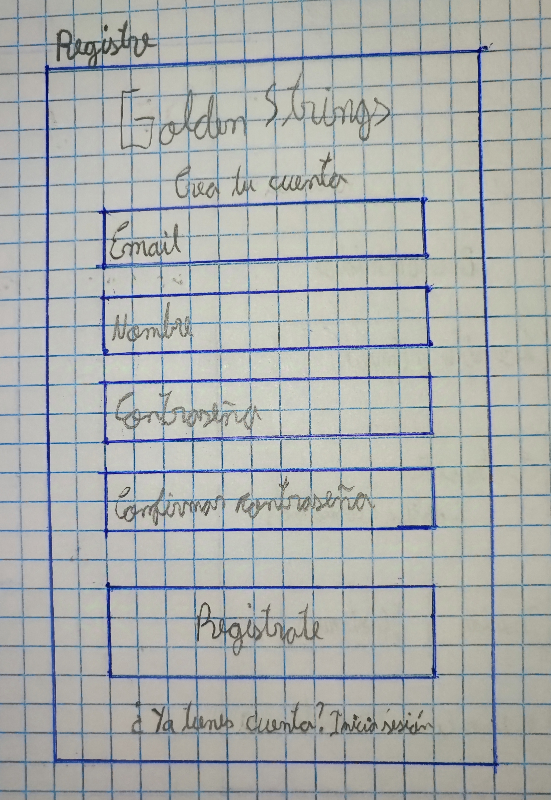

Si el usuario por algún motivo olvidó su contraseña, podrá reestablecerla siempre, esta opción se encuentra debajo del campo contraseña en el inico de sesión. 
Lo primero que se encontrará el usuario es el nombre de la aplicación, un mensaje y un cuadrado donde se le explica que a partir de nombre o email que introduzca, se le enviará un enlace al correo para que pueda reestablecerla. Y si el usario entró por equivocación, podrá redirigirse al inicio de sesión. 

    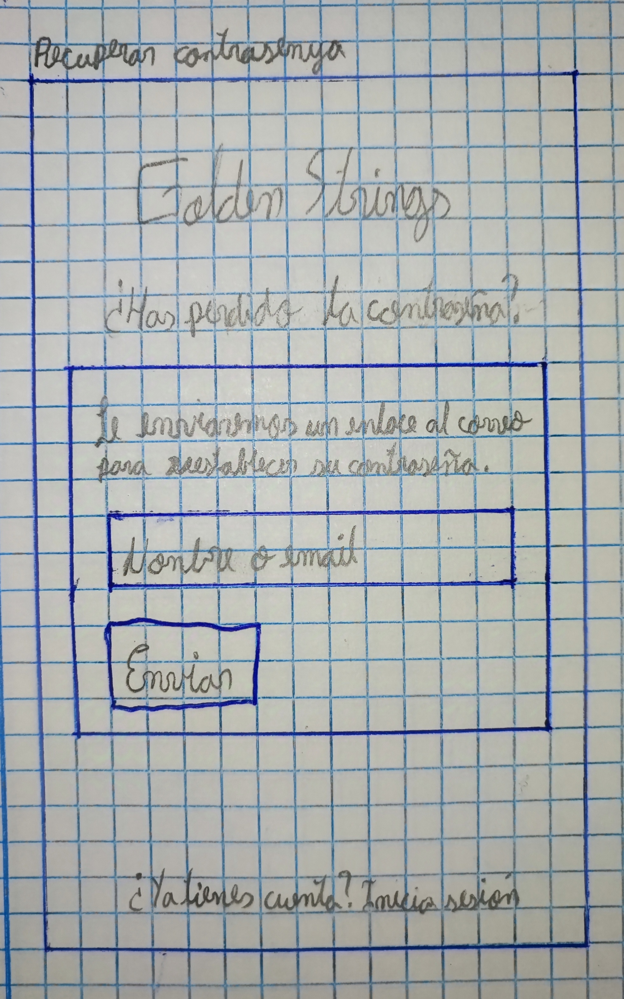

 
 

📌 **Nota:** A partir de ahora en todas las actividades el encabezado siempre tendrá: 
- El nombre de la aplicación en medio, que redireccionará al usuario a la página principal.
- A la izquierda habrá la hamburguesa (aún no está implementada).
- A la derecha del nombre habrá una lupa, que será la búsqueda cuando se le de click.
- A la derecha de la lupa el carrito donde se almacenarán los pedidos.

📌 **Nota:** También en el pié de las actividades, habrá:
- FAQ
- Contacto

## Página principal
Cuando el usuario entra a la página principal, verá la última guitarra lanzada hasta la fecha, luego se encontrará con una breve descripción de la tienda, junto con estos beneficios que aporta la tienda.

Justo debajo de la descripción habrá una serie de productos destacados con sus nombres debido a su alta demanda por los usuarios.

    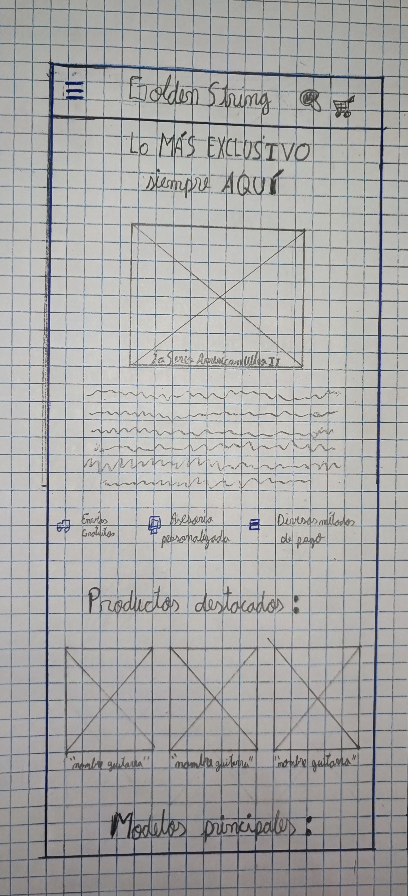

Bajando un poco más en la aplicación, aparecerán algunos modelos principales. Si el usuario entra a un modelo, se le llevará a un catálogo de guitarras. Por otro lado, si el usuario sigue bajando se encontrará con algunas categorias principales sobre las guitarras.

    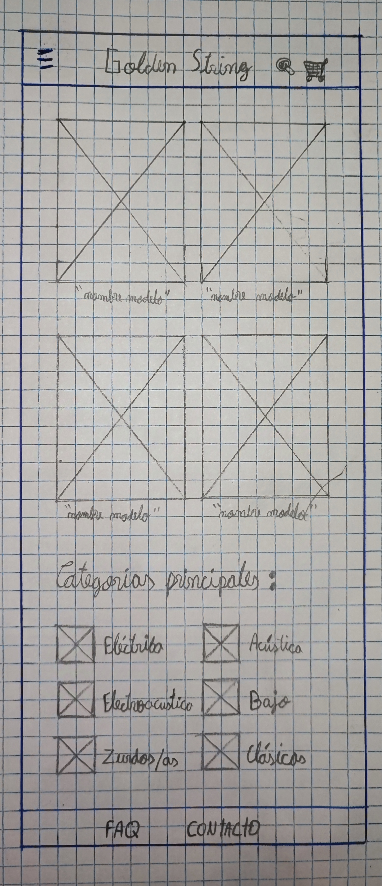

 
 

📌 **Nota:** Después de la página principal, abajo del encabezado a la izquierda, habrá un botón de regreso a la actividad anterior.

## Catálogo de productos
Aquí llegaremos cuando el usuario entra a un modelo de guitarra o categoria, en este caso como ejemplo será sobre un modelo de guitarra.

Se verá el titulo en grande y centrado del modelo de la guitarra que se escogió. Abajo apareceran muchas guitarras con su nombre y precio, donde se podrá hacer scroll para ver muchas más. 

    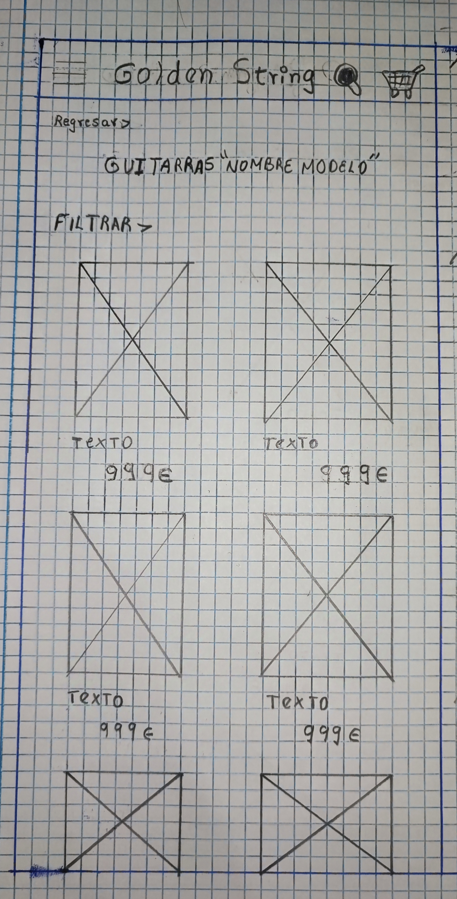

El botón "**Filtrar**" se encuentra debajo a la izquierda del título y cuando se haga click, se desplazara a la derecha hasta la mitad de la actividad.

Dentro de los filtros, como primera opción se podrá ajustar el precio mediante una barra o manualmente. Seguidamente, estará el filtro por marca de guitarra, y por úlitmo, habrá el filtro de modelo de guitarra.

    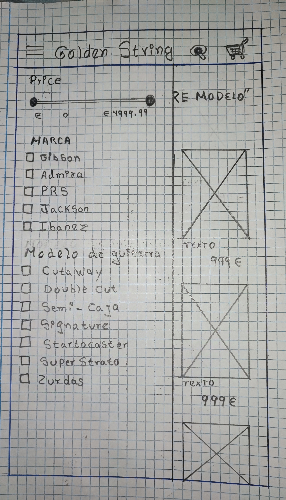

## Detalles del producto
Entraremos a esta actividad cuando el usuario entre a una guitarra en específico.
Lo primero que aparecerá será fotos de la guitarra seleccionada, donde se podrá deslizar a la izquierda para ver más imágenes.
Se encontrará el nombre de la guitarra selecionada con su precio y el logo de la marca, también se podrá selecionar el color que tenga disponible.
Después de la selección de colores, estará el botón de añadir el producto al carrito.

    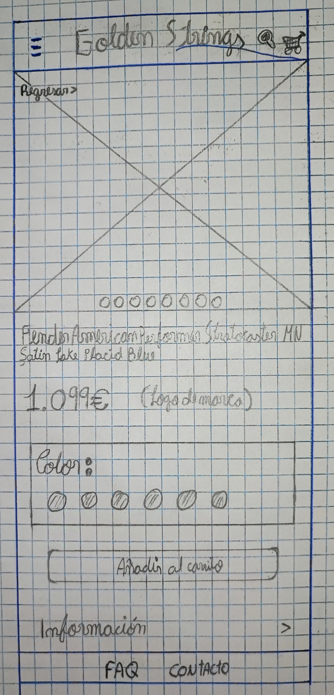

De seguido, se encontrará la información detallada del producto, donde se podrá desplegar hacia abajo.

    

También se podrá acceder a la Ficha tecnica de la guitarra seleccionada, desplazando esa opción hacia abajo.

    

Debajo de la Información y Ficha técnica estarán las valoraciones que darán los usuarios a partir de estrellas y comentarios.

    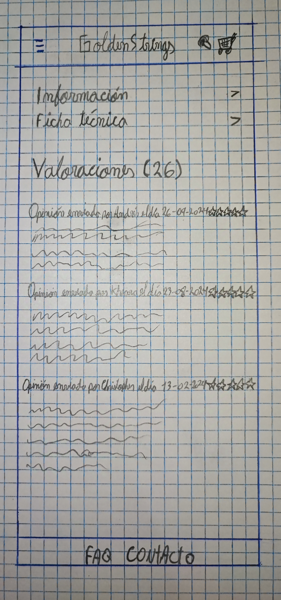

## Carrito de compra y Checkout
Cuando usuario añade productos al carrito, aparecerá el número de productos introducidos. 
Al entrar al carro, se verá el producto añadido con su nombre, imagen y precio, con estas opciones: 
 - aumentar o disminuir la cantidad que se desea de un producto
 - eliminar el producto
 - Ver más productos
 - Tramitar el pedido
 - Añadir el mismo producto pero con un color distinto

    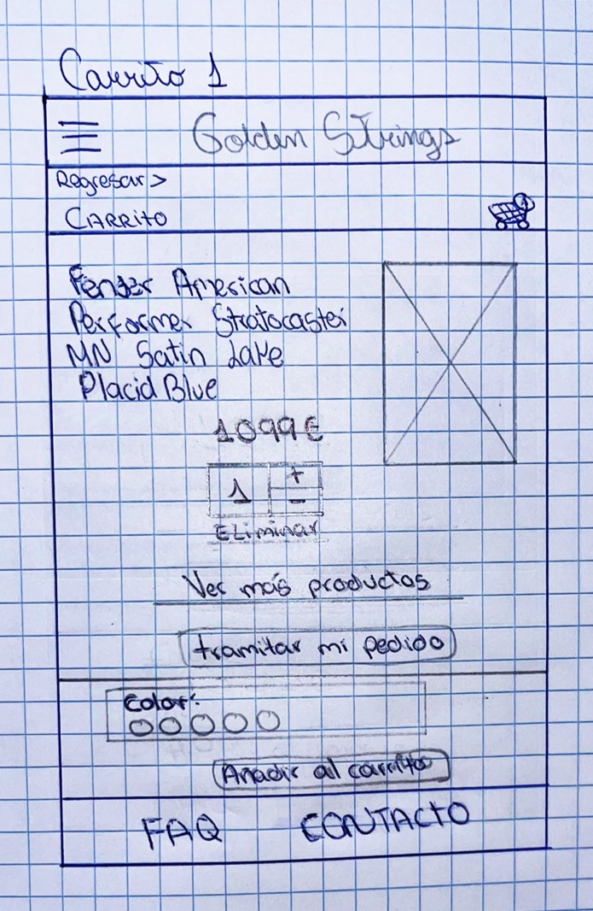

 
 

📌 **Nota:** En la parte inferior de la actividad se encontrará información como "dias de devolución, garantía, segura y métodos de pago"
 
 

Al tramitar el pedido, se **tramitirá el envío**, pidiendo los detalles de envío como:
- Correo electrónico *
- Nombre *
- Apellido *
- Dirección 1 *
- Dirección 2 
- País (escoger) *
- Ciudad * 
- Código postal * 
- Número de teléfono *

También se mostrará el resumen del pedido y los diferentes métodos de pago, para así poder finalizar la compra.

    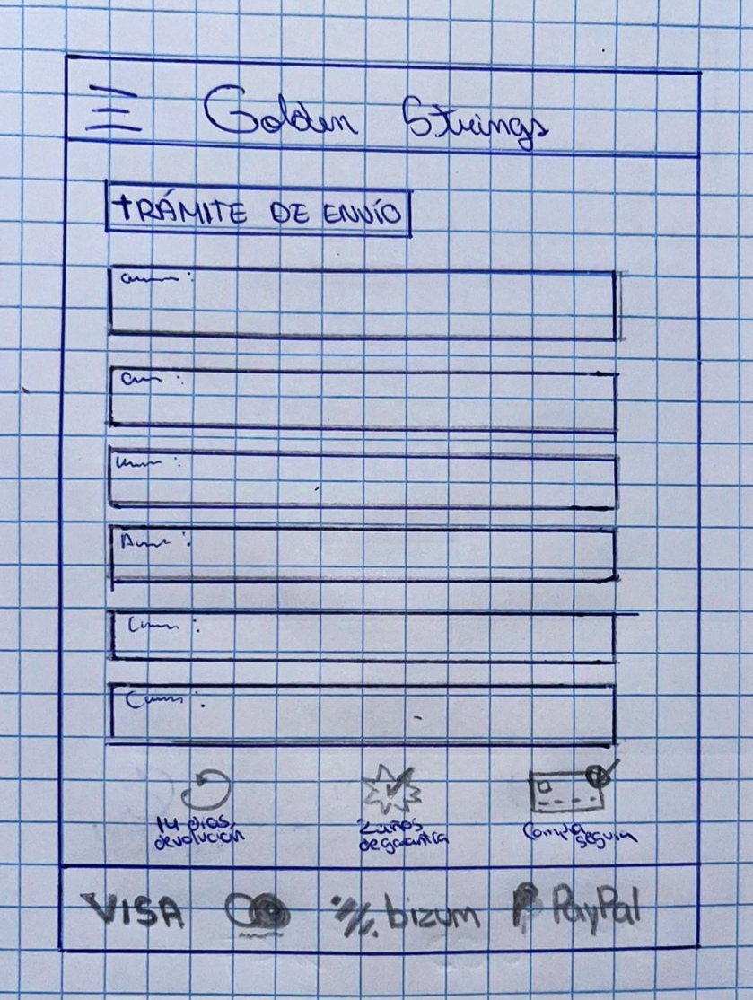
    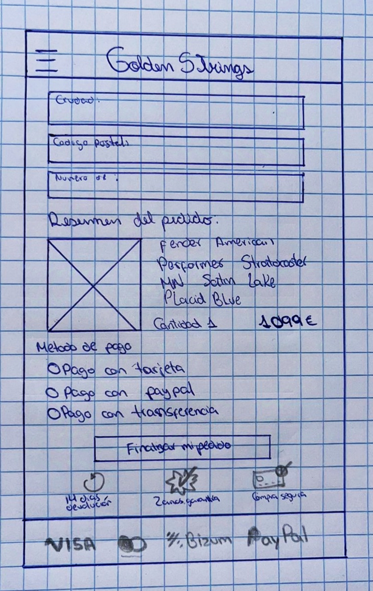

 

## Noticias y Blogs

En la hamburguesa que siempre se encuentra en el encabezado a la derecha, se podrán hacer estas funciones:
- Iniciar sesión
- Ir al carrito
- Ver las categorias
- Ver los modelos
- Ir a Noticias y blogs

    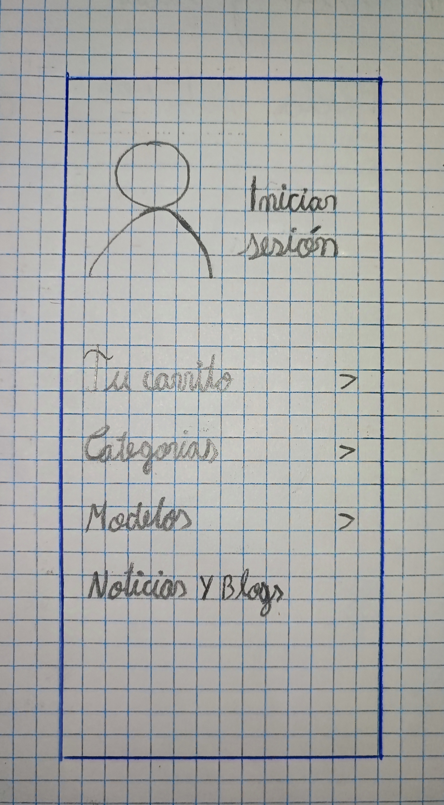

Si el usuario se dirige a **Noticias y Blogs**, se encontrará primero con las noticias destacadas.

Aquí es donde encontrará las noticias más actuales que pasa en la página, como por ejemplo las nuesvas guitarras que puedan llegar a la tienda, o nuevos talleres, etc. Habrá también dos apartados más que son "Novedades" y "Eventos" por si al usuario le interesa.

    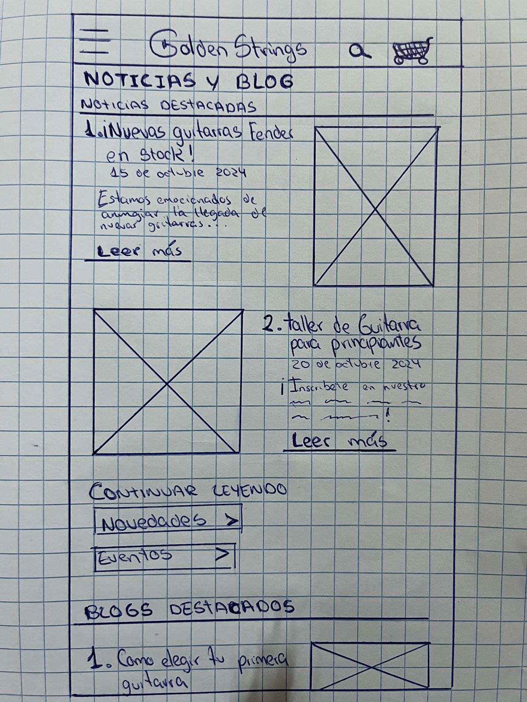

Si se sigue bajando, el usuario se encontrará los blogs destacados, donde podrá ver videos como por ejemplo: Como elegir tu  primera guitarra, consejos para mantener tus instrumentos en condiciones, etc. 
Así mismo, también habrá una sección de guías y tutoriales, y otra sobre consejos y trucos.

    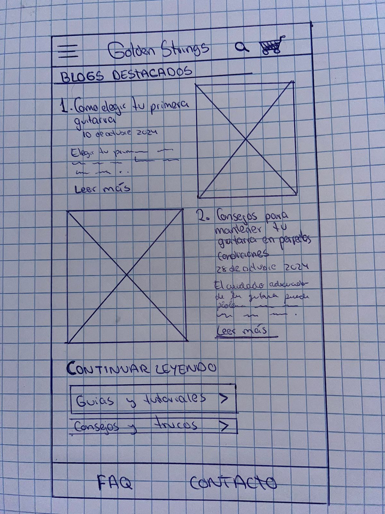

